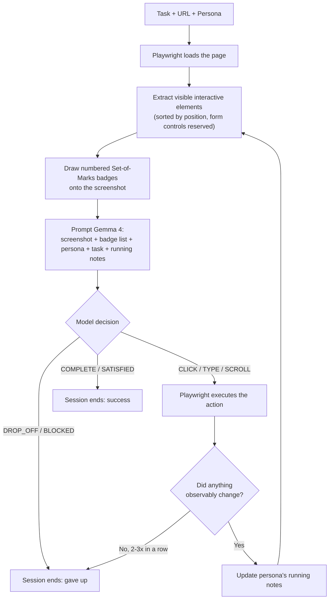

# 🧪 Synthetic Usability Lab

Run AI personas through real usability tests on live websites and Figma prototypes — powered by **Gemma 4 (multimodal)** acting as a set of simulated users with distinct tech literacy, patience, and habits.

Each persona actually browses the page with a headless Chromium session, looks at the screenshot, reasons about what to click, and reports back an internal monologue, a confusion score, and a UX finding — so you can compare how a first-time, low-patience user experiences your flow next to a power user, before you ever recruit a real participant.

<p align="center">
  
</p>


---

## Contents

- [What it does](#what-it-does)
- [Why](#why)
- [How it works](#how-it-works)
- [Reliability features](#reliability-features)
- [Personas](#personas)
- [Try it: two worked examples](#try-it-two-worked-examples)
- [Setup](#setup)
- [Project structure](#project-structure)
- [Running the tests](#running-the-tests)
- [Troubleshooting](#troubleshooting)
- [Known limitations](#known-limitations)
- [Contributing](#contributing)
- [License](#license)

## What it does

1. **Browses the real page.** A Playwright/Chromium session loads your URL (or Figma prototype), extracts every visible interactive element, and draws numbered [Set-of-Marks](https://arxiv.org/abs/2310.11441) badges directly onto the screenshot.
2. **Asks the model to act like the persona.** The annotated screenshot, the element list, the persona's traits, the task goal, and the persona's own running notes go to Gemma 4 as a multimodal prompt. The model returns a decision — `CLICK` / `TYPE` / `SCROLL` / `COMPLETE` / `DROP_OFF` — plus a first-person internal monologue, a confusion percentage, sentiment, and one actionable UX finding.
3. **Executes it for real.** The chosen element actually gets clicked/typed into/scrolled via Playwright, and the loop repeats for up to N steps or until the persona finishes (or gives up).
4. **Replays it.** The Gradio UI renders an animated step-by-step replay per persona, a comparative benchmark table across personas, and a confusion-over-time chart — so friction points are visible at a glance instead of buried in a transcript.

<p align="center">
  
</p>

## Why

Real usability testing is slow to arrange and expensive to run at the volume you'd actually want — every draft of every flow, tested against every persona you care about, before a single real participant is recruited. This isn't a replacement for that: a small multimodal model narrating a text list of badges is not a human, and its "confusion" is a proxy, not a fact. What it *is* good for is a fast, repeatable first pass — catching the missing sort control, the buried CTA, the accordion that swallows the answer you need, before you spend a real participant's time on it.

## How it works



A few design choices that shape everything else in this repo:

- **The model never produces free-form pixel coordinates on a real page.** It picks a badge *number* from the list it's given, and that number is resolved to a real DOM element via a `data-som-id` attribute before Playwright clicks it. This is far more reliable than asking a vision model to guess raw coordinates, but it also means results are bounded by whether the real target survived the element budget for that step, and whether the model maps its stated intent to the *correct* badge number — small multimodal models can and do occasionally describe the right element while picking the wrong badge.
- **Badge numbers are re-assigned every step**, because the page (and therefore the candidate element list) changes as the persona scrolls or navigates. The model is explicitly told never to reuse a number from an earlier step.
- **The persona keeps a running scratchpad** (`observations`) that's carried forward across steps — without this, a persona that scrolls past a good candidate on the way to checking the rest of the page would simply forget it existed by the time it needs to decide.

## Reliability features

These exist because early runs against real sites (not just the bundled demo site) surfaced real failure modes — each of the following is a direct response to something that actually went wrong in testing, not a speculative feature:

| Feature | What it catches |
|---|---|
| **Stall detection** (exact-repeat + general no-progress) | A page where the target control doesn't respond to a synthetic click — without this, the persona silently re-clicks a dead element until it runs out of steps. Auto-terminates as `DROP_OFF` with an explanation instead. |
| **Observation memory** | A persona that surveys a long paginated list and forgets the cheapest item it already found once it scrolls past it. |
| **Confusion scoring rubric** | The model defaulting to 0% confusion on every step regardless of what its own critique says — the prompt now anchors specific score ranges to specific situations and requires the score to be consistent with the critique. |
| **Element-kind labelling** | The model referencing an item's title link when it means the item's "Add to basket" button (or vice versa) — every badge is now labelled by interaction kind (`TEXT INPUT`, `BUTTON`, `LINK`, `DROPDOWN`), not just a bare HTML tag. |
| **Form-control reserved slots** | A search box at the bottom of a long page (e.g. Hacker News) getting truncated out of the element budget in favor of the 45th story link above it. |
| **Page-signature comparison for "did anything change"** | Byte-comparing screenshots fails on any page with a carousel, ad, or blinking cursor. A signature of URL + title + scroll position + element list is used instead. |
| **Input-value verification on TYPE** | A `fill()` call silently landing on the wrong element (a label instead of the real `<input>`) — the executed value is read back and compared against what was intended. |
| **Per-session persona state** | Two concurrent Gradio users editing personas independently, instead of one shared global list. |
| **HTML-escaped replay rendering** | A malicious page's `<title>` or the model's own echoed output injecting a script tag into the replay view. |

## Personas

Personas are plain JSON objects — no special tooling required to add your own to `data/personas.json`:

```json
{
  "id": "unique_id",
  "name": "Display Name, Age",
  "age": 42,
  "tech_literacy": "Low" | "Medium" | "High",
  "habits": "1-2 sentences describing usability biases, friction triggers, and preferences.",
  "patience": 6,
  "avatar": "single emoji"
}
```

The two bundled defaults:

| Persona | Tech literacy | Patience | Habits |
|---|---|---|---|
| **David, 58** 👴 | Low | 7/10 | Suspicious of sharing sensitive info, dislikes jargon like 2FA/TOTP. |
| **Maya, 26** 👩‍💻 | High | 9/10 | Skims text, expects 1-click solutions, impatient. |

You can also describe a persona in plain English in the **Persona Customizer** tab and have the model turn it into this structure — up to 3 active personas at a time, run against the same task in isolated browser sessions and compared side by side.

## Try it: two worked examples

**A note before you write your own task:** end it on an action that produces a real, observable change — a page navigation, a confirmation message, a URL change. `books.toscrape.com`'s "Add to basket" button, for instance, is decorative: it doesn't actually add anything, so a task ending there will trip stall detection and report `DROP_OFF` no matter how well the persona performs. Prefer endings like *"open its product page"* over *"add it to your basket"* on that particular sandbox site.

### 1. Visual reasoning under a hard constraint (low → high → low friction)

```
Persona:  Carol, 68 — Low tech literacy, low patience (4/10), reads every
          word before acting, doesn't scroll unless content is obviously cut off.

Website:  https://books.toscrape.com

Task:     "Find a Science Fiction book that costs under £20 and has a 4-star
          or higher rating, then add it to your basket."

Max steps: 5
```

Navigating to the category is trivial (low friction). But star ratings on this site are pure CSS classes with no visible text — the model has to actually *read the star icons off the screenshot* and cross-reference them against price with no sort/filter tool available, which reliably produces a visible confusion spike mid-run before dropping back down once a qualifying book is found.

### 2. Missing affordance + multi-page survey (tests memory across steps)

```
Persona:  Dev, 34 — High tech literacy, low patience (3/10), habitual
          comparison shopper who expects sort/filter controls and gets
          frustrated when forced to compare options manually.

Website:  https://books.toscrape.com

Task:     "Find the cheapest book in the Mystery category and open its
          product page."

Max steps: 8
```

There's no sort-by-price control, 32 results across multiple pages, and finding the true cheapest requires surveying items well beyond a single viewport — a good test of whether the persona's running notes actually carry the best-candidate-so-far forward instead of getting overwritten by whatever's newest on screen.

## Setup

### Option A — Google Colab (recommended)

This project needs a CUDA GPU with enough VRAM for a 4-bit-quantized multimodal model, which most local machines don't have handy. `colab.ipynb` is the fastest path:

1. Upload this whole folder to your Google Drive.
2. Open `colab.ipynb` in Colab, set `PROJECT_DIR` in the second cell to match where it landed.
3. Add your Hugging Face token to Colab Secrets as `HF_TOKEN` (key icon in the left sidebar) — or paste it when prompted if you skip that step.
4. Run all cells. The last cell launches the Gradio app and prints a public share link (Colab has no reachable localhost, so this is set up automatically for you there).

### Option B — Local

Requires a CUDA-capable GPU and drivers already set up.

```bash
git clone <your-repo-url>
cd synthetic-usability-lab
python -m venv .venv && source .venv/bin/activate   # Windows: .venv\Scripts\activate
pip install -r requirements.txt
playwright install chromium

cp .env.example .env   # then fill in HF_TOKEN
python app.py
```

The app binds to localhost only by default. Public sharing is opt-in via `GRADIO_SHARE=1`. Leave it unset locally: this app drives a headless browser to whatever URL it is given, so a public tunnel hands that capability to anyone with the link.

## Project structure

```
synthetic-usability-lab/
├── app.py                      # Gradio dashboard — entry point, per-session persona state
├── colab.ipynb                 # Google Colab bootstrap notebook
├── requirements.txt
├── requirements-dev.txt        # + pytest, for running the test suite
├── .env.example
├── data/
│   ├── flows.json              # sample UX flow/screen definitions
│   └── personas.json           # default personas (David, Maya)
├── assets/
│   └── screenshots/            # UI screenshots referenced by this README
├── tests/                      # pytest suite — no GPU/model download required
└── src/
    ├── model.py                # Gemma4VisionClient — HF transformers wrapper
    ├── engine.py                # UsabilityEngine — prompt construction + JSON parsing
    ├── browser_agent.py         # WebBrowserRunner — Playwright automation, Set-of-Marks, stall detection
    └── visualizer.py             # HTML/CSS generation for the Gradio replay UI
```

## Running the tests

The suite covers the most failure-prone parts of the pipeline — parsing free-form model output into a usable decision, badge labelling, and the cross-step observation memory — and needs no GPU or model download:

```bash
pip install -r requirements-dev.txt
pytest -q
```

## Troubleshooting

- **`Could not create share link`** — check [Gradio's status page](https://status.gradio.app); the tunnel service is occasionally down and there's nothing to fix locally when it is. Retry later, or run without `GRADIO_SHARE` set if you have a reachable localhost.
- **`pip install -r requirements.txt` reports dependency conflicts in Colab** (e.g. `google-genai`, `starlette`, `pydantic`) — these come from pinning a package Colab already preinstalls a newer version of, forcing an unwanted downgrade. This repo's `requirements.txt` deliberately leaves `gradio` unbounded above for this reason; if you've customized the pins, remove upper bounds on packages Colab ships by default.
- **`RuntimeError: No CUDA device available`** — this project loads a 4-bit quantized model via `bitsandbytes`, which requires a CUDA GPU. Use Colab (Option A above) if you don't have one locally.
- **`Failed to load google/gemma-4-E4B-it`** — almost always a gated-model access issue: visit the model page on Hugging Face and accept its license with the same account whose token you're using, then retry.
- **A step's replay shows `Auto-terminated: repeated action with no visible effect`** — this isn't a bug in the run, it's the stall detector doing its job: the target element didn't respond to a synthetic click. Expand that step's diagnostics panel for the exact `execution_log` line.

## Known limitations

- **Small-model grounding accuracy.** Gemma 4 E4B-it is an edge-oriented model; on visually dense or unfamiliar pages it can occasionally pick the wrong element while describing the right one — treat findings as directional signal, not ground truth.
- **No anti-bot evasion.** Sites with aggressive automation detection (large e-commerce, banking) may block the session outright before the model gets a real screenshot.
- **Single-process, synchronous execution.** Each browser session runs to completion before the next persona starts; there's no request queueing or concurrency limiting for multiple simultaneous users of the same running app.
- **Element budget.** At most 60 elements per screen get badges (form controls hold reserved slots so inputs are never truncated away). On extremely dense pages, some links below the cut simply aren't addressable until the persona scrolls.
- **Unparseable model output aborts the step as `BLOCKED`** rather than guessing — visible in the replay's diagnostics panel along with the parse-failure counter in the logs.
- **Task design matters.** A task whose completion step doesn't produce an observable page change (a decorative button, a no-op form) will trip stall detection regardless of how well the persona performs — see the note at the top of [Try it](#try-it-two-worked-examples).

## Contributing

Issues and PRs welcome. If you're adding a new failure-mode fix, a regression test in `tests/` alongside it is the fastest way to get it merged — see the existing suite for the pattern (stub the LLM client, assert on the constructed prompt or the parsed decision).

## License

MIT — see [LICENSE](LICENSE).
