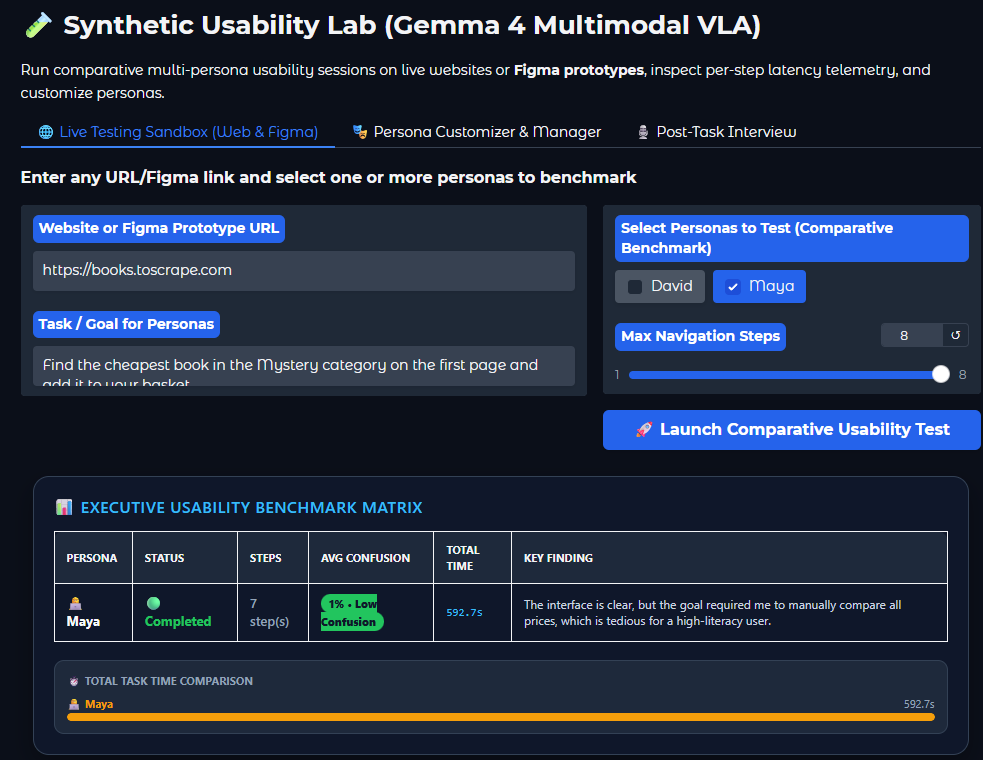
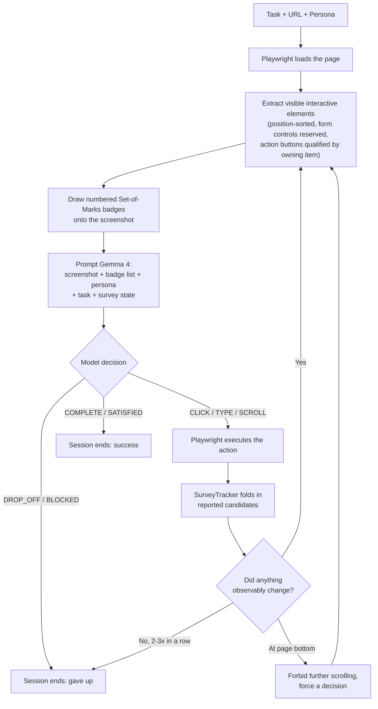
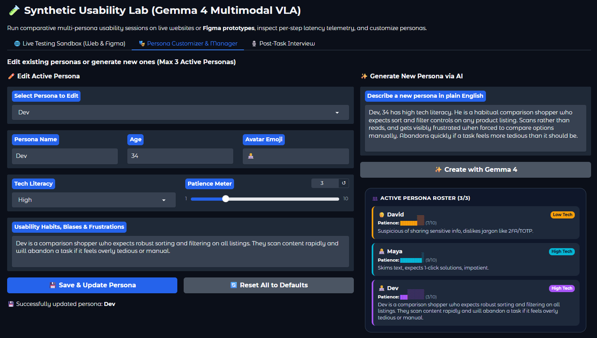

# 🧪 Synthetic Usability Lab

Run AI personas through real usability tests on live websites and Figma prototypes — powered by **Gemma 4 (multimodal)** acting as simulated users with distinct tech literacy, patience, and habits.

Each persona actually browses the page in a headless Chromium session, looks at the screenshot, reasons about what to click, and reports back an internal monologue, a confusion score, and a UX finding — so you can compare how a low-patience first-timer experiences your flow next to a power user, before you ever recruit a real participant.

<p align="center">
  <a href="https://colab.research.google.com/github/PraneetKSahoo/synthetic-usability-lab/blob/main/colab.ipynb"></a>
  <a href="https://huggingface.co/google/gemma-4-E4B-it"></a>
  <a href="https://huggingface.co/google/gemma-4-E4B-it"></a>
  
  
  <br />
  
  
  
  <a href="LICENSE"></a>
</p>

<p align="center">
  
</p>

---

## Contents

- [What it does](#what-it-does)
- [Why](#why)
- [How it works](#how-it-works)
- [Reliability features](#reliability-features)
- [Personas](#personas)
- [Try it: three worked examples](#try-it-three-worked-examples)
- [Setup](#setup)
- [Project structure](#project-structure)
- [Running the tests](#running-the-tests)
- [Troubleshooting](#troubleshooting)
- [Known limitations](#known-limitations)
- [Contributing](#contributing)
- [License](#license)

## What it does

1. **Browses the real page.** A Playwright/Chromium session loads your URL (or Figma prototype), extracts every visible interactive element, and draws numbered [Set-of-Marks](https://arxiv.org/abs/2310.11441) badges directly onto the screenshot.
2. **Asks the model to act like the persona.** The annotated screenshot, the element list, the persona's traits, the task goal, and the system-maintained survey state go to Gemma 4 as a multimodal prompt. The model returns a decision — `CLICK` / `TYPE` / `SCROLL` / `COMPLETE` / `DROP_OFF` — plus a first-person internal monologue, a confusion percentage, sentiment, and one actionable UX finding.
3. **Executes it for real.** The chosen element actually gets clicked, typed into, or scrolled via Playwright, and the loop repeats until the persona finishes, gives up, or runs out of steps.
4. **Replays it.** The Gradio UI renders an animated step-by-step replay per persona, a comparative benchmark table, and a confusion-over-time chart — with the same detail streamed live to your terminal as the run happens.

<p align="center">
  
</p>

<p align="center">
  
</p>

## Why

Real usability testing is slow to arrange and expensive to run at the volume you'd actually want — every draft of every flow, against every persona you care about, before a single participant is recruited. This isn't a replacement for that: a small multimodal model narrating a list of badges is not a human, and its "confusion" is a proxy, not a fact. What it *is* good for is a fast, repeatable first pass — catching the missing sort control, the buried CTA, the accordion that swallows the answer, before you spend a real participant's time on it.

## How it works



Three design choices shape everything else in this repo:

- **The model never produces free-form pixel coordinates on a real page.** It picks a badge *number*, which is resolved to a real DOM element via a `data-som-id` attribute before Playwright acts on it. Far more reliable than asking a vision model to guess coordinates — but results are still bounded by whether the target survived the element budget, and whether the model maps its stated intent to the right badge.
- **Badge numbers are re-assigned every step**, since the candidate list changes as the persona scrolls or navigates. The same item can be `[28]` on one step and `[4]` on the next, so the model is explicitly told never to reuse a number across steps.
- **The model is not trusted with bookkeeping.** For "find the cheapest/best X" tasks it only *reports* what it can currently see (`candidates`, `objective`, `survey_total`); all comparison, accumulation, deduplication, and termination logic lives in [`src/survey.py`](src/survey.py), where it is deterministic and unit-tested. This is the single most important reliability decision in the project — see below for why.

## Reliability features

Each of these is a direct response to something that actually went wrong during live testing, not a speculative feature:

| Feature | What it catches |
|---|---|
| **Code-enforced survey state** | The model recording a best candidate of £10.69, scrolling once, and overwriting it with a *worse* £11.84 — despite an explicit instruction, and then a worked example using those exact numbers, telling it not to. Prompt wording could not fix this; `min()`/`max()` over reported candidates makes the regression arithmetically impossible. |
| **Result-total locking** | The model re-reading the page's stated result count every step and getting a different answer each time (20 → 32 → 24 → 36 → 16) once the header scrolled out of view. The first value read is locked; later guesses are discarded. |
| **Page-bottom termination** | A survey that can never finish. A category advertising "32 results" may render only 20 on page one, so a `seen >= total` exit condition is unreachable — the agent scrolled into the bottom of the page until stall detection killed it. Completion is now decided by DOM geometry (`innerHeight + scrollY >= scrollHeight`), and a scroll requested at the bottom is refused rather than burning a ~90s step. |
| **Action-button disambiguation** | A listing page renders ~20 buttons all labelled "Add to basket", making the correct choice pure visual grounding — and unverifiable from the logs. Each action button is now qualified with its owning item: `Add to basket [for: Tastes Like Fear]`. |
| **Stall detection** (exact-repeat + general no-progress) | A control that doesn't respond to a synthetic click. Without it, the persona re-clicks a dead element until it runs out of steps; now it auto-terminates as `DROP_OFF` with a diagnosable reason. |
| **Page-signature change detection** | Byte-comparing screenshots never matches on pages with carousels, ads, or blinking cursors — silently disabling stall detection exactly where it's needed. A URL + title + scroll + element-list signature is used instead. |
| **Truncation retry** | A monologue listing every price on screen exhausting the token budget mid-number, leaving unclosed JSON and aborting a whole run. One retry with a larger budget and a brevity nudge recovers the step. |
| **Confusion scoring rubric** | The model reporting 0% confusion on every step while its own critique complained about tedious manual comparison. Score bands are now anchored to specific situations and must be consistent with the critique. |
| **Form-control reserved slots** | A search box at the bottom of a long page (Hacker News) truncated out of the element budget in favour of the 45th story link above it. |
| **Derived labels for bare inputs** | An `<input>` with no placeholder, value, or aria-label being dropped entirely — resolved via `<label for>`, wrapping label, or preceding text node. |
| **Input-value verification on TYPE** | A `fill()` silently landing on a wrapper instead of the real input; the value is read back and compared against what was intended. |
| **Per-session persona state** | Concurrent Gradio users overwriting each other's persona rosters through a shared module-level global. |
| **HTML-escaped replay rendering** | A malicious page's `<title>`, or model output echoing it, injecting script into the replay view. |

## Personas

Personas are plain JSON — add your own to `data/personas.json`:

```json
{
  "id": "unique_id",
  "name": "Display Name, Age",
  "age": 42,
  "tech_literacy": "Low" | "Medium" | "High",
  "habits": "1-2 sentences describing usability biases, friction triggers, and preferences.",
  "patience": 6,
  "avatar": "single emoji"
}
```

The two bundled defaults:

| Persona | Tech literacy | Patience | Habits |
|---|---|---|---|
| **David, 58** 👴 | Low | 7/10 | Suspicious of sharing sensitive info, dislikes jargon like 2FA/TOTP. |
| **Maya, 26** 👩‍💻 | High | 9/10 | Skims text, expects 1-click solutions, impatient. |

You can also describe a persona in plain English and have the model turn it into this structure — up to 3 active personas at a time, run against the same task in isolated browser sessions and compared side by side.

<p align="center">
  
</p>

<p align="center">
  
</p>

## Try it: three worked examples

**Before writing your own task:** end it on an action that produces a real, observable change — a navigation, a confirmation, a URL change. `books.toscrape.com`'s "Add to basket" is decorative and changes nothing, so a task ending there will trip stall detection no matter how well the persona performs. Prefer *"open its product page"* on that particular sandbox.

### 1. Search and navigate — the quickest end-to-end check

```
Persona:  Maya, 26 — High tech literacy, patience 9/10, skims text.
Website:  https://en.wikipedia.org
Task:     "Search for 'Fitts's law' and open its article."
Steps:    4
```

The fastest way to confirm a working install. Exercises the `TYPE` → fill → Enter path and the input-vs-button distinction, uses no survey logic at all, and finishes in 2–3 steps with an unambiguous success state. Wikipedia doesn't fingerprint headless browsers and has clean semantic markup, so failures here are real failures rather than bot-blocking.

### 2. Visual reasoning under a hard constraint

```
Persona:  Carol, 68 — Low tech literacy, patience 4/10, reads every word,
          doesn't scroll unless content is obviously cut off.
Website:  https://books.toscrape.com
Task:     "Find a Science Fiction book under £20 with a 4-star or higher
          rating, then open its product page."
Steps:    5
```

Star ratings on this site are CSS classes with no text, so the model must read the star icons *off the screenshot* and cross-reference against price with no sort or filter available — reliably producing a confusion spike mid-run.

### 3. Missing affordance + multi-viewport survey

```
Persona:  Dev, 34 — High tech literacy, patience 3/10, comparison shopper
          who expects sort/filter controls.
Website:  https://books.toscrape.com
Task:     "Find the cheapest book in the Mystery category and open its
          product page."
Steps:    8
```

No sort-by-price control and more items than fit one viewport, so finding the true cheapest requires surveying across several scrolls. This is the scenario the `SurveyTracker` exists for — watch the `Best` row in the terminal hold steady at the correct item as the surveyed count climbs.

## Setup

### Option A — Google Colab (recommended)

This needs a CUDA GPU with enough VRAM for a 4-bit-quantized multimodal model, which most laptops don't have. `colab.ipynb` is the fastest path:

1. Upload this folder to your Google Drive.
2. Open `colab.ipynb` in Colab and set `PROJECT_DIR` in the second cell to match where it landed.
3. Add your Hugging Face token to Colab Secrets as `HF_TOKEN` (key icon in the sidebar) — or paste it when prompted.
4. Run all cells. The last one launches the app and prints a public share link (Colab has no reachable localhost, so this is enabled automatically there).

### Option B — Local

Requires a CUDA-capable GPU with drivers already set up.

```bash
git clone https://github.com/PraneetKSahoo/synthetic-usability-lab.git
cd synthetic-usability-lab
python -m venv .venv && source .venv/bin/activate   # Windows: .venv\Scripts\activate
pip install -r requirements.txt
playwright install chromium

cp .env.example .env   # then fill in HF_TOKEN
python app.py
```

The app binds to localhost only by default. Public sharing is opt-in via `GRADIO_SHARE=1` — leave it unset locally, since this drives a headless browser at whatever URL it's given, and a public tunnel hands that capability to anyone with the link.

## Project structure

```
synthetic-usability-lab/
├── app.py                      # Gradio dashboard — entry point, per-session persona state
├── colab.ipynb                 # Google Colab bootstrap notebook
├── requirements.txt
├── requirements-dev.txt        # + pytest, for the test suite
├── .env.example
├── data/
│   ├── flows.json              # sample UX flow/screen definitions
│   └── personas.json           # default personas (David, Maya)
├── assets/screenshots/         # images referenced by this README
├── tests/                      # pytest suite — no GPU or model download required
└── src/
    ├── model.py                # Gemma4VisionClient — HF transformers wrapper
    ├── engine.py               # UsabilityEngine — prompt construction, JSON parsing, retry
    ├── survey.py               # SurveyTracker — code-enforced "cheapest/best" bookkeeping
    ├── browser_agent.py        # WebBrowserRunner — Playwright, Set-of-Marks, stall detection
    └── visualizer.py           # HTML/CSS generation for the Gradio replay UI
```

## Running the tests

98 tests covering the parts that actually broke in practice — JSON/decision parsing, survey bookkeeping, scroll termination, action disambiguation, badge labelling, and step logging. No GPU or model download needed:

```bash
pip install -r requirements-dev.txt
pytest -q
```

## Troubleshooting

- **`Could not create share link`** — check [Gradio's status page](https://status.gradio.app); the tunnel service is occasionally down and nothing local will fix it. Retry later, or run without `GRADIO_SHARE` if you have a reachable localhost.
- **Dependency conflicts on `pip install` in Colab** (`google-genai`, `starlette`, `pydantic`) — caused by pinning a package Colab preinstalls a newer version of, forcing a downgrade. This repo deliberately leaves `gradio` unbounded above for that reason; if you customise the pins, avoid upper bounds on packages Colab ships. Restart the runtime after installing.
- **`RuntimeError: No CUDA device available`** — a 4-bit quantized model via `bitsandbytes` needs a CUDA GPU. Use Colab.
- **`Failed to load google/gemma-4-E4B-it`** — usually gated-model access: accept the licence on the model page with the same account as your token. Note that `huggingface_hub.login()` saves the token to disk rather than setting `HF_TOKEN`, which is also checked.
- **`Auto-terminated: repeated action with no visible effect`** — not a bug; the stall detector firing because the target didn't respond to a synthetic click. Expand that step's diagnostics for the exact `execution_log` line.
- **A step reports `SCROLL refused: already at the bottom`** — expected. The agent asked to scroll past the end of the document, and the runner declined rather than waste an inference step.

## Known limitations

- **Small-model grounding accuracy.** Gemma 4 E4B-it is edge-oriented; on dense pages it can pick the wrong element while describing the right one in its monologue. Treat findings as directional signal, not ground truth.
- **The prompt is tuned toward listing and comparison tasks.** Much of the accumulated guidance (survey rules, superlative handling, "add to basket"-style examples) came from debugging e-commerce-shaped flows. It should transfer — the mechanisms are generic — but tasks that look nothing like "find the best X in a list" are less exercised. Example 1 above exists partly to test that.
- **Some site-specific selectors remain.** The element scraper still names `.product_pod`, `.side_categories`, and `.price_color` from the bundled demo site. These are additive and inert elsewhere, but they are scaffolding, not general logic.
- **No anti-bot evasion.** Sites with aggressive automation detection (large e-commerce, banking) may block the session before the model sees a real screenshot.
- **Single-process, synchronous execution.** Personas run sequentially; there's no queueing or concurrency limiting for multiple simultaneous users of one running app.
- **Element budget.** At most 60 elements per screen get badges (form controls hold reserved slots). On very dense pages, links below the cut aren't addressable until the persona scrolls.
- **Inference is slow.** 45–105s per step on a Colab T4, dominated by model deliberation. An 8-step run across two personas takes roughly 20 minutes.
- **Task design matters.** A task whose final action produces no observable page change will trip stall detection regardless of how well the persona performed.

## Contributing

Issues and PRs welcome. If you're fixing a failure mode, a regression test in `tests/` alongside it is the fastest route to merge — see the existing suite for the pattern (stub the LLM client, assert on the constructed prompt or the parsed decision).

## License

MIT — see [LICENSE](LICENSE).
